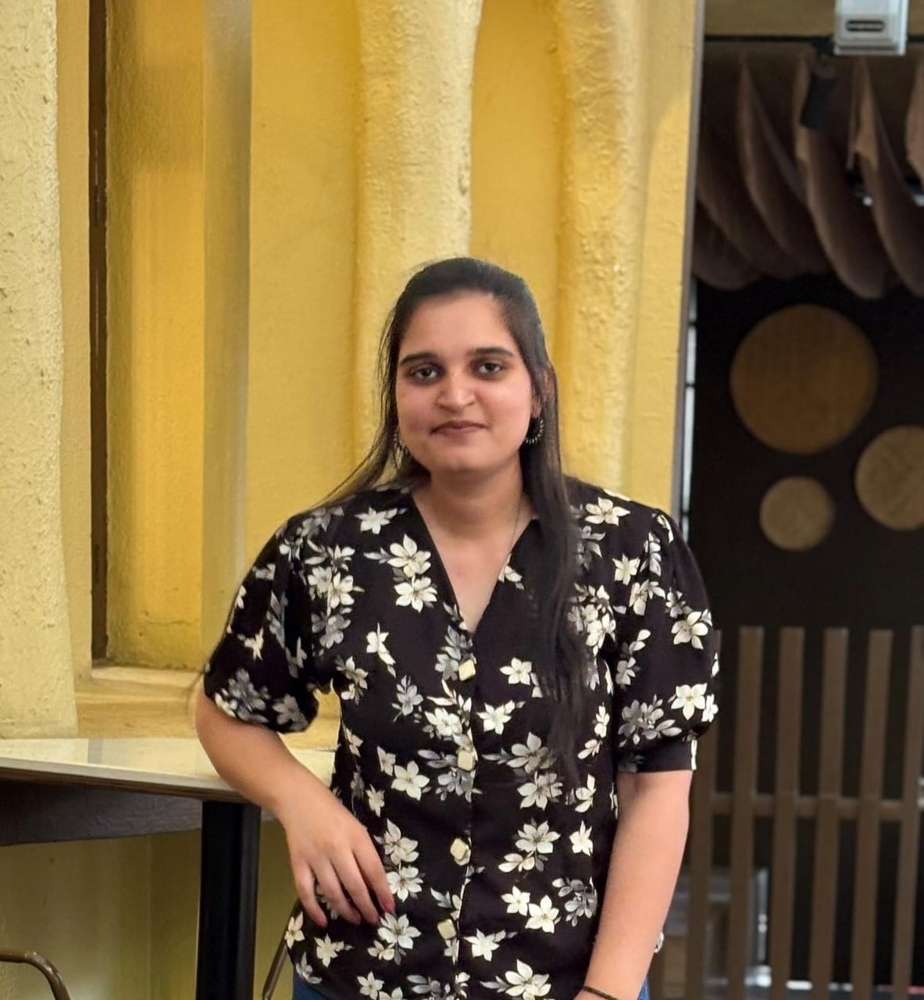

# 👋 Hi, I'm Gaurangi Kapare

### 💻 Full Stack Developer | AWS & DevOps Enthusiast

---

## 👩‍💻 About Me

I am an Information Technology engineering student passionate about **Full Stack Development, Cloud Computing, and DevOps**.

I enjoy building practical web applications and learning how modern applications are developed, deployed, and maintained.

* 🎓 BE Information Technology Student
* 💻 Interested in Full Stack Web Development
* ☁️ Exploring AWS and Cloud Technologies
* 🐳 Working with Docker and Containerization
* ⚙️ Learning CI/CD and Kubernetes
* 🔐 Interested in Authentication and Authorization
* 🔗 Experienced with REST APIs and Socket.IO
* 🗄️ Working with SQL and NoSQL Databases
* 🚀 Passionate about building real-world applications

---

## 🛠️ Languages and Tools

---

## ☁️ Cloud & DevOps

---

## 📊 GitHub Analytics

---

## 🔥 GitHub Streak

---

## 🏆 GitHub Achievements

---

## 🤝 Connect With Me

---

### ⭐ Thanks for visiting my profile!

